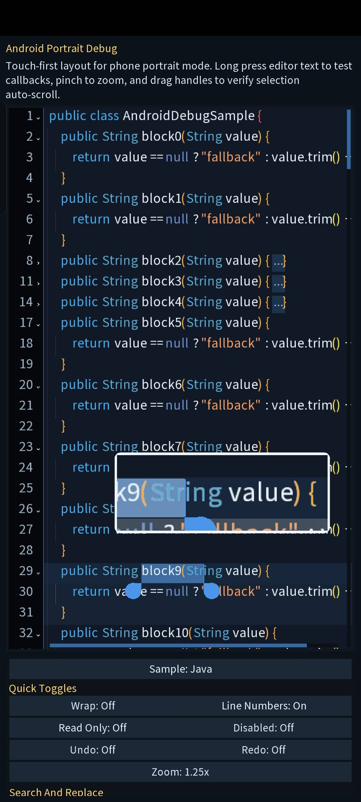
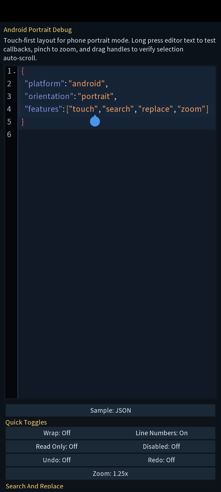

# gdx-code-editor

`gdx-code-editor` is a libGDX Scene2D code editor widget for large-text editing, syntax highlighting, code folding, search/replace, and touch or mouse interaction.

The library is designed for in-app script editors, config editors, lightweight IDE tools, and any Scene2D UI that needs an embeddable code editor.

## Features

- Scene2D `Widget`-based `CodeEditor`
- Large-text line-based document model
- Syntax highlighting
- Code structure analysis and folding
- Fixed or scrolling line numbers
- Search highlight and current-match highlight
- Find next / previous match
- Replace current / replace all
- Undo / redo with compound edits
- Rainbow brackets and rainbow guides
- Touch and mouse interaction modes
- Touch handles, long press, inertial scrolling, pinch zoom
- Right-click / long-press integration hooks
- Read-only and disabled modes
- Public extension points for:
  - syntax highlighting
  - code structure analysis
  - interaction behavior
  - content change observation

## Screenshots

### Java editing and context menu


### JSON highlighting


### Android portrait mode with touch selection handles


### Android portrait mode with touch cursor


## Installation

Add JitPack:

```gradle
repositories {
    mavenCentral()
    maven { url 'https://jitpack.io' }
}
```

Add the dependency:

```gradle
dependencies {
    implementation 'com.github.Lzt841:gdx-code-editor:v0.0.5'
}
```

Kotlin DSL:

```kotlin
repositories {
    mavenCentral()
    maven("https://jitpack.io")
}

dependencies {
    implementation("com.github.Lzt841:gdx-code-editor:v0.0.5")
}
```

## Quick Start

```java
import com.badlogic.gdx.graphics.g2d.BitmapFont;
import com.badlogic.gdx.scenes.scene2d.Stage;
import com.badlogic.gdx.scenes.scene2d.ui.Table;
import com.lzt841.editor.CodeEditor;
import com.lzt841.editor.highlight.BuiltinCodeHighlighters;
import com.lzt841.editor.structure.BraceCodeStructureProvider;

BitmapFont font = new BitmapFont();

CodeEditor.CodeEditorStyle style = CodeEditor.CodeEditorStyle.theme(font)
    .themeColor(new Color(0.24f, 0.55f, 0.92f, 1f))
    .backgroundColor(new Color(0.06f, 0.08f, 0.11f, 1f))
    .gutterColor(new Color(0.03f, 0.04f, 0.05f, 1f))
    .build();

CodeEditor editor = new CodeEditor(style);
editor.setText("public class Demo {\n\tvoid test() {}\n}");
editor.setHighlighter(BuiltinCodeHighlighters.java());
editor.setStructureProvider(new BraceCodeStructureProvider());
editor.setWrapEnabled(false);
editor.setLineNumbersFixed(true);

Table root = new Table();
root.setFillParent(true);
root.add(editor).expand().fill();

Stage stage = new Stage();
stage.addActor(root);
```

## Public API Style

The extension-facing APIs now use libGDX collections instead of `java.util.List`.

- `CodeHighlighter` works with `Array<String>` and returns `Array<Array<...>>`
- `CodeStructureProvider` takes `Array<String>`
- `CodeStructureInfo.foldRegions` is `Array<CodeFoldRegion>`
- `CodeDocument.snapshotLines()` returns `Array<String>`

## Built-in Highlighters

```java
editor.setHighlighter(BuiltinCodeHighlighters.java());
editor.setHighlighter(BuiltinCodeHighlighters.kotlin());
editor.setHighlighter(BuiltinCodeHighlighters.javascript());
editor.setHighlighter(BuiltinCodeHighlighters.python());
editor.setHighlighter(BuiltinCodeHighlighters.json());
editor.setHighlighter(BuiltinCodeHighlighters.xml());
editor.setHighlighter(BuiltinCodeHighlighters.plainText());
```

## Structure Providers

Brace-based languages:

```java
editor.setStructureProvider(new BraceCodeStructureProvider());
```

Python-style indent structure:

```java
editor.setStructureProvider(new PythonIndentCodeStructureProvider());
```

Custom collapsed-fold display:

```java
editor.setFoldDisplayProvider(new CodeEditor.FoldDisplayProvider() {
    @Override
    public String getCollapsedText(CodeEditor editor, CodeEditor.FoldDisplayContext context) {
        return ".." + context.endLineText.trim();
    }
});
```

The default implementation already appends the trimmed end line, so brace folds render like `{..}` instead of `{..`.

## Search and Replace

```java
editor.setSearchText("value");
editor.setSearchCaseSensitive(false);

int matchCount = editor.getSearchMatchCount();
boolean hasCurrent = editor.hasCurrentSearchMatch();
int currentOrdinal = editor.getCurrentSearchMatchOrdinal();

editor.findNextSearchMatch();
editor.findPreviousSearchMatch();

editor.replaceCurrentSearchMatch("result");
editor.replaceAllSearchMatches("result");
```

Notes:

- the current match has its own highlight
- replace-all is grouped as one undo/redo step
- typing over a selection replaces the selected text first
- tab characters in `setText(...)` content are measured and rendered consistently

## Content Change Listener

You can observe editor content mutations for code completion, diagnostics, indexing, autosave, or other tooling.

```java
editor.addContentListener(new CodeEditorContentListener() {
    @Override
    public void onContentChanged(CodeEditor editor, CodeEditorContentChangeEvent event) {
        if (event.type == CodeEditorContentChangeType.INSERT
            || event.type == CodeEditorContentChangeType.PASTE) {
            // trigger completion after typing or paste
        }

        String text = event.text;
        int version = event.documentVersion;
        int cursorLine = event.cursorLine;
        int cursorColumn = event.cursorColumn;

        // trigger linting, parsing, indexing, autosave, etc.
    }
});
```

The callback is triggered after actual content changes such as:

- typing
- delete / backspace
- paste
- replace current / replace all
- undo / redo
- `setText(...)`

The event payload includes:

- `type`: mutation kind such as `INSERT`, `DELETE`, `PASTE`, `UNDO`, `REDO`
- `text`: full document text after the change
- `documentVersion`: incremented editor document version
- `cursorLine` and `cursorColumn`: caret position after the change

## Interaction Hooks

```java
editor.setInteractionMode(CodeEditorInteractionMode.AUTO);
editor.setInteractionMode(CodeEditorInteractionMode.MOUSE);
editor.setInteractionMode(CodeEditorInteractionMode.TOUCH);
```

Optional interaction listener:

```java
editor.setInteractionListener(new CodeEditorInteractionListener() {
    @Override
    public boolean onLongPress(CodeEditor editor, CodeEditorInteractionContext context) {
        return false;
    }

    @Override
    public boolean onSecondaryClick(CodeEditor editor, CodeEditorInteractionContext context) {
        return false;
    }

    @Override
    public boolean onDoubleClick(CodeEditor editor, CodeEditorInteractionContext context) {
        return false;
    }
});
```

## States and View Control

```java
editor.setReadOnly(true);
editor.setDisabled(false);

editor.setZoomScale(1.25f);
float zoom = editor.getZoomScale();
```

Touch mode also supports pinch zoom.

## Style

`CodeEditorStyle` is similar in spirit to libGDX `TextFieldStyle`. You can still assign every drawable manually, but the recommended path is to start from the built-in theme builder.

### Theme Builder

```java
CodeEditor.CodeEditorStyle style = CodeEditor.CodeEditorStyle.theme(font)
    .themeColor(new Color(0.24f, 0.55f, 0.92f, 1f))
    .backgroundColor(new Color(0.06f, 0.08f, 0.11f, 1f))
    .gutterColor(new Color(0.03f, 0.04f, 0.05f, 1f))
    .textColor(Color.WHITE)
    .gutterTextColor(new Color(0.66f, 0.72f, 0.8f, 1f))
    .textBaselineOffset(-6f)
    .build();
```

The builder automatically creates a full editor theme, including:

- background and focused background
- gutter background and divider
- cursor, selection, search highlight, and current-match highlight
- fold icons and fold badge
- scrollbar track and knob
- touch selection handle

If you do not explicitly set scrollbar width or selection handle size, the builder derives sensible defaults from the font line height, so larger fonts automatically get larger handles and scrollbars.

If the builder creates its own white-pixel texture internally, you can release it with:

```java
style.disposeGeneratedResources();
```

### Manual Style

You can also populate `CodeEditorStyle` yourself when you want full control over every drawable and size.

Common drawable fields:

- `background`
- `focusedBackground`
- `disabledBackground`
- `gutterBackground`
- `currentBlock`
- `currentLine`
- `cursor`
- `selection`
- `searchHighlight`
- `currentSearchHighlight`
- `selectionHandle`
- `bracketMatch`
- `guide`
- `foldExpanded`
- `foldCollapsed`
- `foldBadge`
- `scrollbarTrack`
- `scrollbarKnob`

Common sizing fields:

- `textLeftPadding`
- `textRightPadding`
- `rowPadding`
- `gutterMinWidth`
- `gutterFoldIndicatorGap`
- `foldIndicatorSize`
- `foldIndicatorRightPadding`
- `scrollbarWidth`
- `scrollbarHitWidth`
- `scrollbarGap`
- `guideSpacing`
- `guideOffsetX`
- `selectionHandleRadius`

Example:

```java
CodeEditor.CodeEditorStyle style = new CodeEditor.CodeEditorStyle();
style.font = font;
style.foldExpanded = expandedDrawable;
style.foldCollapsed = collapsedDrawable;
style.foldIndicatorSize = 10f;
style.selectionHandleRadius = 12f;
style.scrollbarWidth = 8f;
style.guideSpacing = 18f;
```

## Extending the Library

### Custom Highlighter

Implement `CodeHighlighter`:

```java
public class MyHighlighter implements CodeHighlighter {
    @Override
    public Array<Array<CodeHighlightSpan>> highlight(Array<String> lines, CodeEditor.CodeEditorStyle style) {
        return new Array<>();
    }
}
```

### Custom Structure Provider

Implement `CodeStructureProvider`:

```java
public class MyStructureProvider implements CodeStructureProvider {
    @Override
    public CodeStructureInfo analyze(Array<String> lines) {
        return new CodeStructureInfo(new int[lines.size], new Array<CodeFoldRegion>());
    }
}
```

## Local Demo

Run the desktop demo from the repository:

```bash
./gradlew lwjgl3:run
```

Windows:

```powershell
./gradlew.bat lwjgl3:run
```

## Notes

- `CodeEditorStyle.font` must not be `null`
- published artifacts do not include the local demo entrypoint
- the default structure provider is brace-based
- Python is best paired with `PythonIndentCodeStructureProvider`

## License

This repository should include a `LICENSE` file for distribution and reuse.
