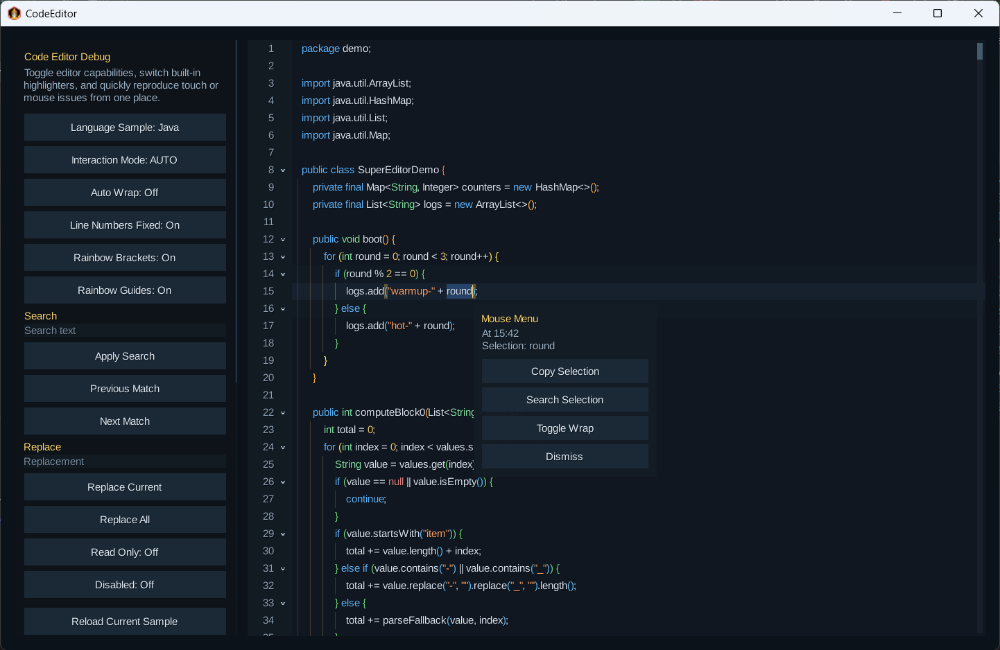
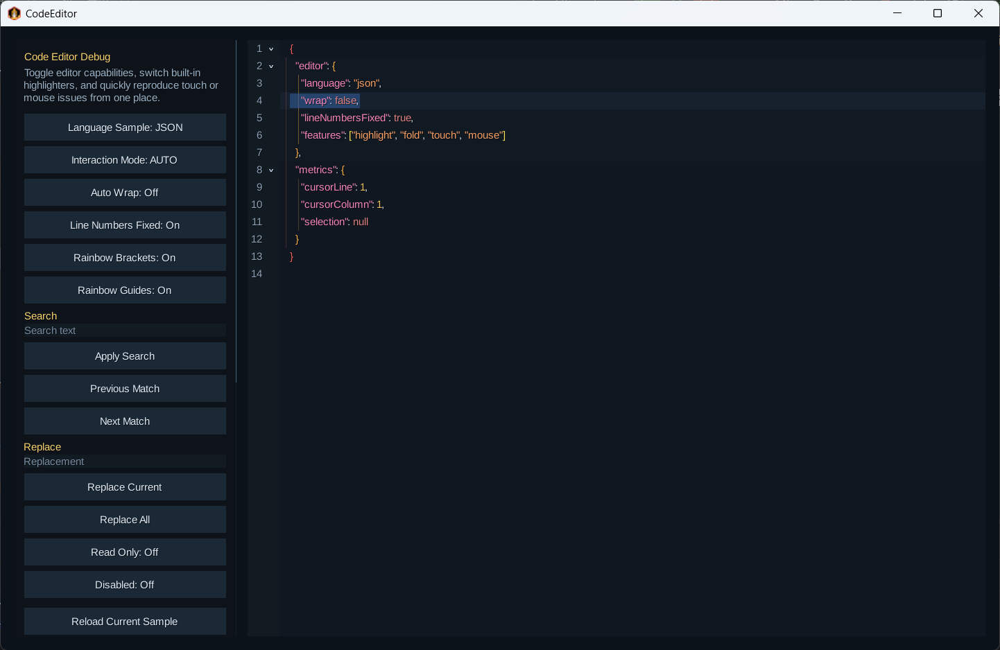
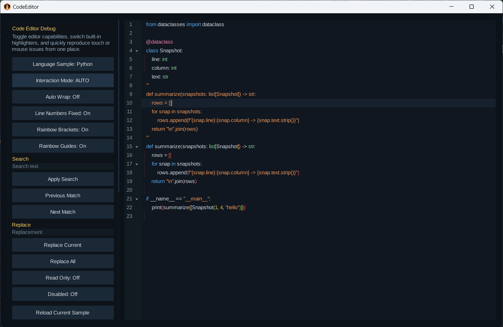
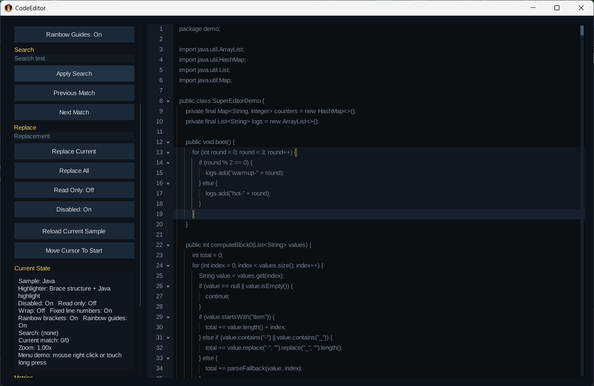

# gdx-code-editor

`gdx-code-editor` 是一个基于 libGDX Scene2D 的代码编辑器组件，适合作为应用内嵌的代码输入、脚本编辑、配置编辑或轻量 IDE 编辑区使用。

它提供了一个可直接加入 Scene2D 布局系统的 `CodeEditor` Widget，重点支持：

- 大文本高性能编辑
- 语法高亮
- 自动换行与横向滚动
- 代码块结构分析
- 代码折叠
- 彩虹括号与彩虹引导线
- 查找 / 上一个 / 下一个命中
- 替换 / 全部替换
- 撤销 / 重做
- 鼠标与触摸双交互模式

项目仓库中包含桌面 Demo，但发布到依赖中的内容只包含编辑器库本身，不包含演示入口。

## 演示效果

### Java 编辑、查找与右键菜单


### JSON 高亮与折叠区域


### Python 缩进结构、彩虹括号与引导线


### Disabled 状态展示


## 功能特性

- `CodeEditor` 是标准 Scene2D `Widget`
- 基于按行文档模型，适合大文本编辑
- 支持固定行号和非固定行号
- 默认关闭自动换行，可按需开启
- 支持横向滚动与滚动条拖动
- 支持代码折叠、折叠徽标、点击折叠内容自动展开
- 支持括号匹配、高亮当前代码块、彩虹括号、彩虹引导线
- 支持搜索结果背景高亮与当前命中单独高亮
- 支持替换当前命中、全部替换，并接入撤销重做
- 支持连续输入、连续删除、批量替换的复合历史记录
- 支持 `readOnly` 和 `disabled` 两种状态
- 支持触摸模式下的手柄选择、惯性滚动、长按菜单、双指缩放
- 支持鼠标模式下的拖拽选择、双击选词、右键菜单、滚轮滚动
- 支持自定义高亮器、结构提供器、交互监听器和样式

## 安装

### Gradle

在项目仓库中添加 JitPack：

```gradle
repositories {
    mavenCentral()
    maven { url 'https://jitpack.io' }
}
```

添加依赖：

```gradle
dependencies {
    implementation 'com.github.Lzt841:gdx-code-editor:v0.0.1'
}
```

### Kotlin DSL

```kotlin
repositories {
    mavenCentral()
    maven("https://jitpack.io")
}

dependencies {
    implementation("com.github.Lzt841:gdx-code-editor:v0.0.1")
}
```

## 快速开始

最小使用示例：

```java
import com.badlogic.gdx.graphics.g2d.BitmapFont;
import com.lzt841.editor.CodeEditor;
import com.lzt841.editor.highlight.BuiltinCodeHighlighters;
import com.lzt841.editor.structure.BraceCodeStructureProvider;

BitmapFont font = new BitmapFont();

CodeEditor.CodeEditorStyle style = new CodeEditor.CodeEditorStyle();
style.font = font;

CodeEditor editor = new CodeEditor(style);
editor.setText("public class Demo {\n    void test() {}\n}");
editor.setHighlighter(BuiltinCodeHighlighters.java());
editor.setStructureProvider(new BraceCodeStructureProvider());
editor.setWrapEnabled(false);
editor.setLineNumbersFixed(true);
```

加入 Scene2D：

```java
Table root = new Table();
root.setFillParent(true);
root.add(editor).expand().fill();
stage.addActor(root);
```

## 常用能力

### 1. 设置高亮器

```java
editor.setHighlighter(BuiltinCodeHighlighters.java());
editor.setHighlighter(BuiltinCodeHighlighters.kotlin());
editor.setHighlighter(BuiltinCodeHighlighters.javascript());
editor.setHighlighter(BuiltinCodeHighlighters.python());
editor.setHighlighter(BuiltinCodeHighlighters.json());
editor.setHighlighter(BuiltinCodeHighlighters.xml());
editor.setHighlighter(BuiltinCodeHighlighters.plainText());
```

### 2. 设置结构分析器

大多数括号语言：

```java
editor.setStructureProvider(new BraceCodeStructureProvider());
```

Python 缩进结构：

```java
editor.setStructureProvider(new PythonIndentCodeStructureProvider());
```

### 3. 搜索

```java
editor.setSearchText("value");
editor.setSearchCaseSensitive(false);

int count = editor.getSearchMatchCount();
boolean hasCurrent = editor.hasCurrentSearchMatch();
int currentOrdinal = editor.getCurrentSearchMatchOrdinal();

editor.findNextSearchMatch();
editor.findPreviousSearchMatch();
```

### 4. 替换

```java
editor.replaceCurrentSearchMatch("result");
editor.replaceAllSearchMatches("result");
```

说明：

- 当前命中有单独高亮
- 单次替换支持撤销 / 重做
- 全部替换会作为一次复合编辑进入历史记录

### 5. 编辑状态

```java
editor.setReadOnly(true);
editor.setDisabled(false);
```

### 6. 交互模式

```java
import com.lzt841.editor.input.CodeEditorInteractionMode;

editor.setInteractionMode(CodeEditorInteractionMode.AUTO);
editor.setInteractionMode(CodeEditorInteractionMode.MOUSE);
editor.setInteractionMode(CodeEditorInteractionMode.TOUCH);
```

### 7. 缩放

```java
editor.setZoomScale(1.25f);
float zoom = editor.getZoomScale();
```

触摸模式下还支持双指缩放。

## 样式

`CodeEditorStyle` 的设计方式接近 libGDX 的 `TextFieldStyle`，可以统一配置编辑器的颜色、背景、图标和布局尺寸。

常见可配置项包括：

- `font`
- `background`
- `focusedBackground`
- `disabledBackground`
- `gutterBackground`
- `currentBlock`
- `currentLine`
- `cursor`
- `selection`
- `searchHighlight`
- `currentSearchHighlight`
- `selectionHandle`
- `bracketMatch`
- `guide`
- `foldExpanded`
- `foldCollapsed`
- `foldBadge`
- `scrollbarTrack`
- `scrollbarKnob`

还支持一批尺寸参数，例如：

- `textLeftPadding`
- `textRightPadding`
- `rowPadding`
- `gutterMinWidth`
- `gutterFoldIndicatorGap`
- `foldIndicatorSize`
- `foldIndicatorRightPadding`
- `scrollbarWidth`
- `scrollbarHitWidth`
- `scrollbarGap`
- `guideSpacing`
- `selectionHandleRadius`

示例：

```java
CodeEditor.CodeEditorStyle style = new CodeEditor.CodeEditorStyle();
style.font = font;
style.foldExpanded = expandedDrawable;
style.foldCollapsed = collapsedDrawable;
style.foldIndicatorSize = 10f;
style.selectionHandleRadius = 12f;
style.scrollbarWidth = 8f;
style.guideSpacing = 18f;
```

## 可扩展能力

### 自定义语法高亮

实现 `CodeHighlighter` 即可扩展自己的语言高亮逻辑。

可用于：

- 输出语法高亮 span
- 标记括号忽略区域
- 控制不同语言下的高亮策略

### 自定义结构分析

实现 `CodeStructureProvider` 即可扩展：

- 代码块结构
- 折叠区域
- 缩进层级
- 当前块信息

### 自定义交互菜单

实现 `CodeEditorInteractionListener` 可以接入：

- 触摸长按菜单
- 鼠标右键菜单
- 双击行为扩展

## 仓库结构

- `core`
  编辑器核心库
- `core/src/main/java/com/lzt841/editor`
  编辑器主体实现
- `core/src/main/java/com/lzt841/editor/highlight`
  高亮相关接口与内置实现
- `core/src/main/java/com/lzt841/editor/structure`
  结构分析、代码块与折叠相关接口
- `core/src/main/java/com/lzt841/editor/input`
  鼠标与触摸交互抽象
- `core/src/main/java/com/lzt841/demo`
  本地调试 Demo
- `lwjgl3`
  桌面启动模块
- `android`
  Android 示例工程

## 运行仓库内 Demo

```bash
./gradlew lwjgl3:run
```

Windows：

```powershell
./gradlew.bat lwjgl3:run
```

## 注意事项

- `CodeEditorStyle.font` 不能为空
- 默认结构分析器适合大多数括号语言
- Python 建议使用 `PythonIndentCodeStructureProvider`
- 查找当前是纯文本匹配，不区分 token 类型
- 发布依赖中不包含 `com.lzt841.demo.Main`

## License
- Apache-2.0
