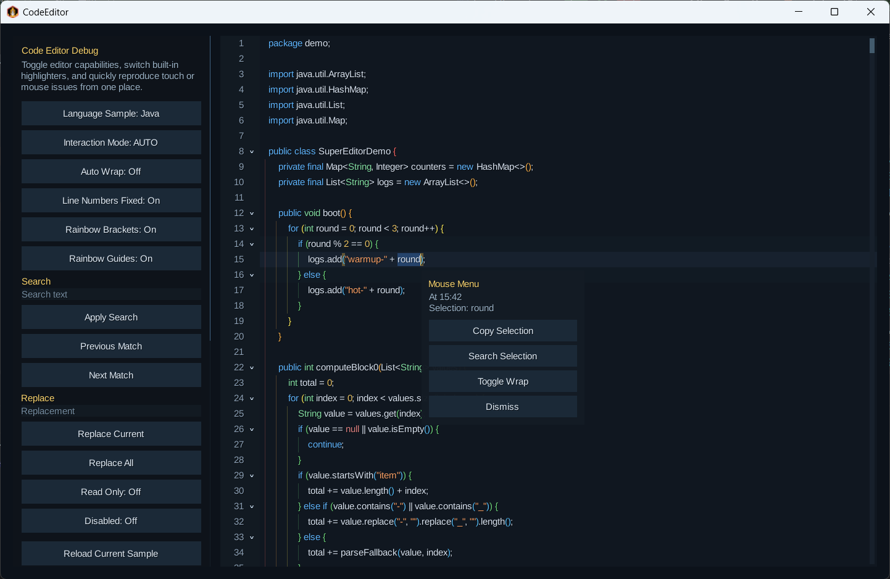
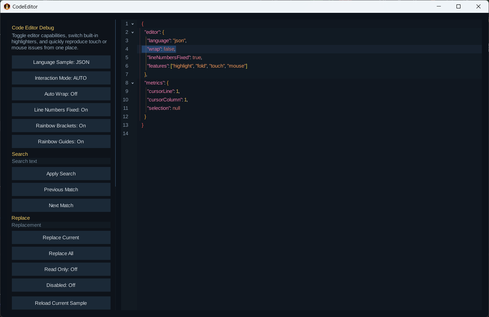
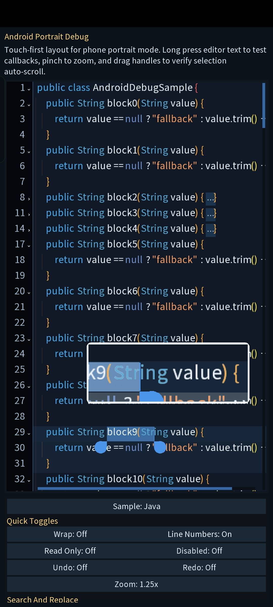
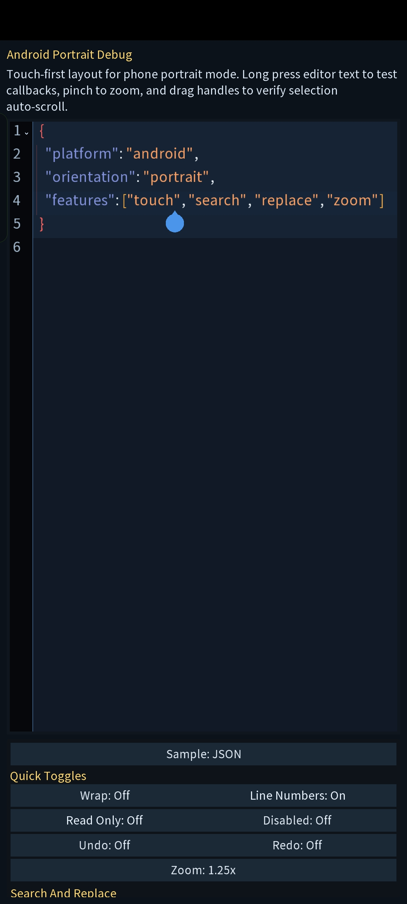

# gdx-code-editor

`gdx-code-editor` is a libGDX Scene2D code editor widget for large-text editing, syntax highlighting, code folding, search/replace, and touch or mouse interaction.

The library is designed for in-app script editors, config editors, lightweight IDE tools, and any Scene2D UI that needs an embeddable code editor.

## Features

- Scene2D `Widget`-based `CodeEditor`
- Large-text line-based document model, built for 100k+ lines
- Incremental syntax highlighting, only for lines on screen
- Semantic highlight overlay, for the local-vs-field-vs-parameter distinction a lexer cannot make
- Code structure analysis and folding
- Symbol tree for an outline, a breadcrumb and go-to-symbol
- Fixed or scrolling line numbers
- Search highlight and current-match highlight
- Literal, whole-word and regular expression search, optionally confined to the selection
- Find next / previous match
- Replace current / replace all
- Undo / redo with named compound edits and a configurable history budget
- Rainbow brackets and rainbow guides
- Touch and mouse interaction modes
- Touch handles, long press, inertial scrolling, pinch zoom
- Right-click / long-press integration hooks
- Read-only and disabled modes
- Rebindable keyboard shortcuts through a named-action keymap
- Code completion with a built-in popup and documentation side panel
- Snippets with placeholder tabbing, mirrored stops, choices and variables
- Hover tooltips and parameter hints
- Go to definition, find references and rename, with a word-level fallback
- Auto-closing brackets and quotes, wrap selection, pair delete
- Line marks for breakpoints, bookmarks and change bars
- Configurable indent strategy, block indent and Shift-Tab dedent
- Diagnostics with squiggles and gutter marks
- Caret geometry and coordinate-mapping queries for custom overlays
- Public extension points for:
  - syntax highlighting (whole-document or incremental)
  - code structure analysis
  - interaction behavior
  - auto-edit behaviour on typing, Backspace and Enter
  - content, caret and hover observation
  - keyboard interception
  - key chord to named action mapping
  - navigation (definition, references, rename)

## Screenshots

### Java editing and context menu


### JSON highlighting


### Android portrait mode with touch selection handles


### Android portrait mode with touch cursor


## Installation

Add JitPack:

```gradle
repositories {
    mavenCentral()
    maven { url 'https://jitpack.io' }
}
```

Add the dependency:

```gradle
dependencies {
    implementation 'com.github.Lzt841:gdx-code-editor:v0.0.6'
}
```

Kotlin DSL:

```kotlin
repositories {
    mavenCentral()
    maven("https://jitpack.io")
}

dependencies {
    implementation("com.github.Lzt841:gdx-code-editor:v0.0.6")
}
```

## Quick Start

```java
import com.badlogic.gdx.graphics.g2d.BitmapFont;
import com.badlogic.gdx.scenes.scene2d.Stage;
import com.badlogic.gdx.scenes.scene2d.ui.Table;
import com.lzt841.editor.CodeEditor;
import com.lzt841.editor.highlight.BuiltinCodeHighlighters;
import com.lzt841.editor.structure.BraceCodeStructureProvider;

BitmapFont font = new BitmapFont();

CodeEditor.CodeEditorStyle style = CodeEditor.CodeEditorStyle.theme(font)
    .themeColor(new Color(0.24f, 0.55f, 0.92f, 1f))
    .backgroundColor(new Color(0.06f, 0.08f, 0.11f, 1f))
    .gutterColor(new Color(0.03f, 0.04f, 0.05f, 1f))
    .build();

CodeEditor editor = new CodeEditor(style);
editor.setText("public class Demo {\n\tvoid test() {}\n}");
editor.setHighlighter(BuiltinCodeHighlighters.java());
editor.setStructureProvider(new BraceCodeStructureProvider());
editor.setWrapEnabled(false);
editor.setLineNumbersFixed(true);

Table root = new Table();
root.setFillParent(true);
root.add(editor).expand().fill();

Stage stage = new Stage();
stage.addActor(root);
```

## Public API Style

The extension-facing APIs now use libGDX collections instead of `java.util.List`.

- `CodeHighlighter` works with `Array<String>` and returns `Array<Array<...>>`
- `CodeStructureProvider` takes `Array<String>`
- `CodeStructureInfo.foldRegions` is `Array<CodeFoldRegion>`
- `CodeDocument.snapshotLines()` returns `Array<String>`

## Built-in Highlighters

```java
editor.setHighlighter(BuiltinCodeHighlighters.java());
editor.setHighlighter(BuiltinCodeHighlighters.kotlin());
editor.setHighlighter(BuiltinCodeHighlighters.javascript());
editor.setHighlighter(BuiltinCodeHighlighters.python());
editor.setHighlighter(BuiltinCodeHighlighters.json());
editor.setHighlighter(BuiltinCodeHighlighters.xml());
editor.setHighlighter(BuiltinCodeHighlighters.plainText());
```

All of them are incremental, so the editor only highlights the lines it draws.

## Semantic Highlighting

The built-in highlighters are per-line state machines. That is what makes them cheap enough to run on
the visible rows every frame, and it is also why none of them can tell a local variable from a field
from a parameter: the answer depends on scope, which a single line does not contain. Push semantic
tokens from something that does have that information and the editor draws them over the lexical
result.

```java
Array<CodeSemanticToken> tokens = new Array<>();
tokens.add(new CodeSemanticToken(3, 8, 13, CodeSemanticTokenType.PROPERTY));
tokens.add(new CodeSemanticToken(4, 12, 17, CodeSemanticTokenType.VARIABLE));

int version = editor.getDocumentVersion();   // before the analysis
// ... resolve, possibly on another thread ...
editor.setSemanticTokens(tokens, version);   // false if the document moved on
```

A token covers one line — `line`, `startColumn` inclusive, `endColumn` exclusive. There is no
`endLine`: an identifier never spans a line break, and the restriction is what lets the editor store
tokens per line and find a row's tokens by index instead of scanning. Emit one token per line for a
genuinely multi-line construct.

`CodeSemanticTokenType` mirrors the standard LSP token types one for one, so a caller driving the
editor from a language server can map `SemanticTokenTypes` across without a translation table.

### Colours

A token's colour resolves in three steps: its own `color` if set, then the style's entry for its type,
then nothing — in which case the lexical colour shows through unchanged.

Leaving `color` null is the better default. It keeps the producer out of theming, so switching themes
recolours semantic tokens with everything else. Set it for a meaning the enum does not carry, such as
dimming an unused symbol.

```java
style.setSemanticTokenColor(CodeSemanticTokenType.PROPERTY, new Color(0.96f, 0.52f, 0.72f, 1f));
style.applyDefaultSemanticTokenColors();   // sensible values for the rest, derived from the palette
```

Types with an exact lexical counterpart (`STRING`, `NUMBER`, `COMMENT`, the type kinds, `KEYWORD`,
`DECORATOR`, `ENUM_MEMBER`) already fall back to the matching style colour, so a semantic `STRING` is
the colour the highlighter would have used anyway — their value is in the cases a lexer gets wrong,
like an embedded language or a contextual keyword.

The identifier kinds a lexer cannot produce at all — `VARIABLE`, `PARAMETER`, `PROPERTY`, `FUNCTION`,
`METHOD`, `NAMESPACE`, `MACRO`, `OPERATOR`, `EVENT` — resolve to nothing by default. Those are exactly
the distinctions this feature exists to draw, so choosing colours for them is the theme's call, not
the library's: a default would change how every existing theme looks the moment tokens were pushed.
Call `applyDefaultSemanticTokenColors()` for a starting set, or set your own.

Layering is lexical, then semantic, then rainbow brackets. Semantic over lexical is the point — it is
the better-informed answer about the same identifier. Rainbow over semantic is not a ranking; the two
barely overlap, since semantic tokens cover identifiers and literals while brackets are punctuation, so
on the rare collision the single-character span the user explicitly asked for wins.

### Staleness

Tokens are pushed against a document version and `setSemanticTokens(tokens, version)` returns false if
the text has changed since. The batch is rejected whole rather than partly applied: after an insertion
its line numbers are wrong from the edit down, and applying the valid top half would leave the file
correctly coloured above the edit and silently uncoloured below it, which reads as a bug in the
producer rather than a stale push.

When an edit does land, tokens on the lines it touched are dropped and the rest are shifted with their
lines. So typing leaves a lexically-coloured hole on the edited line while the rest of the file keeps
its colours, instead of smearing them out of position. Watch for it with:

```java
if (editor.isSemanticTokensStale()) {
    // re-analyse; what is on screen is still positioned correctly, just incomplete
}
editor.setSemanticHighlightEnabled(false);   // stop drawing, keep the tokens
editor.clearSemanticTokens();                // drop them
```

Two caveats worth knowing. Tokens are dropped entirely, not shifted, if an edit is too large for the
editor's edit journal to replay, since how the lines moved is then unknown and painting the wrong
identifiers is worse than painting none. And on a token handed back by `getSemanticTokensAtLine(line)`,
the `line` you asked for is authoritative while the token's own `line` field may lag: surviving tokens
are moved by slot, not rewritten, because rewriting would allocate a fresh token for every one below
the edit on every keystroke.

## Structure Providers

Brace-based languages:

```java
editor.setStructureProvider(new BraceCodeStructureProvider());
```

Python-style indent structure:

```java
editor.setStructureProvider(new PythonIndentCodeStructureProvider());
```

Custom collapsed-fold display:

```java
editor.setFoldDisplayProvider(new CodeEditor.FoldDisplayProvider() {
    @Override
    public String getCollapsedText(CodeEditor editor, CodeEditor.FoldDisplayContext context) {
        return ".." + context.endLineText.trim();
    }
});
```

The default implementation already appends the trimmed end line, so brace folds render like `{..}` instead of `{..`.

### Writing an incremental provider

`CodeStructureProvider.analyze(lines)` walks the whole document per call. Extend
`AbstractIncrementalStructureProvider` instead and you write one method that handles a single line, from
which the whole-document contract is filled in for you, so the two paths cannot disagree:

```java
public class MyStructureProvider extends AbstractIncrementalStructureProvider {
    @Override
    public int analyzeLine(CharSequence line, int startState, CodeStructureLineContext context) {
        for (int i = 0; i < line.length(); i++) {
            char c = line.charAt(i);
            if (c == '{') {
                context.openBlock(0);                       // starts on the current line
            } else if (c == '}') {
                context.closeBlock(context.getLineIndex());  // ends on the current line
            }
        }
        return START_STATE;                                 // nothing carries to the next line
    }
}
```

**The provider does not own the block stack.** It opens and closes blocks through the context, and the
caller keeps the frames. That is the point of the split: everything carrying a line number stays on the
caller's side, where an edit can shift it without the provider being involved. What is left for you is
per-line lexing, which is the part that actually differs between languages.

So `startState` only has to carry what a line needs from the lines above it that is *not* already in the
stack — "inside a block comment", "inside a triple-quoted string". Depth, start lines and indent widths
belong in the stack instead. States are compared with `==`, so use small constants, not hashes, and keep
`analyzeLine` pure: the same line with the same state and stack must always produce the same result.

Two things are less obvious than they look. `closeBlock` takes an **explicit end line** because a brace
closes on its own line while an indentation-based block closes at the last line that had content *above*
the line that de-dented — that is what `markContentLine()` and `getLastContentLine()` are for. And
`finish` decides what happens to blocks still open at end of file, where the two built-ins want opposite
things: `BraceCodeStructureProvider` leaves an unclosed brace open, since folding from it to the end of
the file would fold the wrong range, while `PythonIndentCodeStructureProvider` closes everything, since an
indentation block genuinely ends when the file does.

A block's key is whatever you need in order to decide later whether it should close — an indent width for
an indentation-based language, unused for a brace-based one. Read it back with `getBlockKey(index)`; the
caller only stores it. Depth is not stored at all, because a frame's index in the stack *is* its depth.

Both built-in providers are incremental, so this only matters if you write your own. A plain
`CodeStructureProvider` keeps working unchanged.

Converting a provider is what buys the incremental pass. The editor stores a checkpoint of the scan state
every 256 lines and, after an edit, resumes from the last checkpoint at or above the change and scans
forward only until a recomputed checkpoint matches the stored one — the same convergence idea the
incremental highlighter uses, extended to compare the whole block stack including start lines. Fold regions
above the resume point are kept as they were, and the ones below are spliced in.

In practice an edit costs one or two checkpoint intervals: on a 9000-line file, a change near the end
re-scans about 44 lines and one in the middle 256. Two shapes legitimately re-scan further, and
`getStructureScanLineCount()` will show it. Opening a block comment really does change every line below it.
And an edit on the very line a still-open block opens on cannot converge at all, because the edit journal is
line-granular: whether that block's `{` survived and where it moved to is not knowable, so every checkpoint
below it still holds the old start line. Both cases produce correct results, just not cheaply.

If any of that is in doubt the editor silently falls back to a full `analyze`, so a converted provider is
never worse than an unconverted one. To drive the per-line scan yourself, `CodeStructureScanner` is the
piece that owns the block stack, with `captureCheckpoint` / `restoreCheckpoint` for resuming partway down a
document.

## Symbol Tree

A symbol tree drives an outline view, a breadcrumb, and a go-to-symbol dialog. It is off by default; install a `CodeSymbolProvider` on the structure provider to turn it on.

```java
editor.setStructureProvider(
    new BraceCodeStructureProvider().setSymbolProvider(new JavaCodeSymbolProvider()));
```

Symbols are handed the fold regions the structure pass already computed, rather than scanning the document
again. But extraction walks every region, which costs far more than the incremental scan does, so **symbols
run on their own timer and never land on a keystroke.** Folding and indent guides refresh with the caret;
the outline follows a moment later. Measured on a 100k-line file with 28k regions, that took a keystroke
from 22.5 ms to 4.3 ms — the same cost as having no symbol provider installed at all.

Two consequences worth knowing. The tree is **not cleared** while it waits, because blanking an outline on
every keystroke is worse than showing positions that are briefly a little stale; `isSymbolAnalysisPending()`
says when that is the case, and `refreshSymbolsNow()` skips the wait. And every query method
(`getSymbols`, `getSymbolAt`, `getSymbolPath`, `findSymbols`, `goToSymbol`) forces the pass, so a caller that
asks always gets an answer describing the current text — never a stale one.

This applies to an incremental provider. A plain `CodeStructureProvider` computes symbols inside its own
`analyze()`, where there is no separate pass to defer, so that path keeps its original timing.

```java
Array<CodeSymbol> roots = editor.getSymbols();      // document order, nesting in CodeSymbol.children
CodeSymbol here = editor.getSymbolAt(line);         // innermost containing that line
Array<CodeSymbol> crumbs = editor.getSymbolPath(line);   // root -> ... -> innermost
Array<CodeSymbol> hits = editor.findSymbols("draw");     // flat, case-insensitive, empty query = all
editor.goToSymbol(hits.first());                    // caret on the name, expands a fold if needed
```

Each `CodeSymbol` carries two ranges. `startLine`..`endLine` is the whole construct, which is what a breadcrumb and an outline's expand state want. `selectionStartLine` with `selectionStartColumn`/`selectionEndColumn` is just the name, which is where go-to should put the caret. `CodeSymbolKind` mirrors the Language Server Protocol's kinds.

`goToSymbol` returns false when the symbol no longer fits the document. A `CodeSymbol` is a snapshot, so one held across an edit that deleted its lines is stale; it is rejected rather than clamped to the last line, so you can tell "went there" from "that is gone now".

`getSymbols` forces a pending analysis and returns a shallow copy — the symbols and their `children` arrays belong to the editor, so treat them as read-only. `getSymbolCount()` allocates nothing and does not flush, which makes it safe to poll from a status display but means it can lag `getSymbols()` while the deferred pass is outstanding; `isSymbolAnalysisPending()` tells you when.

### What the Java Provider Recognises

`JavaCodeSymbolProvider` is a heuristic for C-family syntax, not a parser, and it is written to say nothing rather than guess. It names types, methods and constructors, fields and constants, enum constants, imports and the package, and `// MARK:` / `// region` headings as `SECTION`. It handles a body that opens and closes on one line, and a signature whose parameter list wraps across lines.

Deliberately excluded: locals inside a method body, anonymous class members, and control-flow or initializer blocks. An unrecognised block does not create an anonymous level; nothing inside it is reported.

Known limits: a field whose initializer is a multi-line array literal is skipped; `int a, b, c;` reports only the last name; a block comment whose continuation lines do not start with `*` can leak one line into the outline. Treat the output as good enough for an outline and a breadcrumb, not as a source of truth for refactoring.

Both built-in structure providers take a symbol provider, and either can be given a custom one:

```java
editor.setStructureProvider(
    new PythonIndentCodeStructureProvider().setSymbolProvider(myProvider));
```

Set the symbol provider before the first analysis, or call `editor.setStructureProvider(...)` again afterwards — mutating a provider the editor already ran does not by itself invalidate the cached result.

## Search and Replace

```java
editor.setSearchText("value");
editor.setSearchCaseSensitive(false);

int matchCount = editor.getSearchMatchCount();
boolean hasCurrent = editor.hasCurrentSearchMatch();
int currentOrdinal = editor.getCurrentSearchMatchOrdinal();

editor.findNextSearchMatch();
editor.findPreviousSearchMatch();

editor.replaceCurrentSearchMatch("result");
editor.replaceAllSearchMatches("result");
```

Notes:

- the current match has its own highlight
- replace-all is grouped as one undo/redo step
- typing over a selection replaces the selected text first

### Match Modes

```java
editor.setSearchWholeWord(true);          // delimited by non-word characters on both sides
editor.setSearchRegexEnabled(true);       // treat the search text as a pattern
editor.setSearchText("(\\w+)\\s*=\\s*(\\d+)");

if (!editor.isSearchPatternValid()) {
    label.setText(editor.getSearchRegexError());
}

// $1 / $2 in the replacement refer to capture groups
editor.replaceAllSearchMatches("$2 = $1");
```

A word character is a letter, a digit or `_`, the same definition double-click selection uses. Whole
word applies to regex matches too, so `\w+` in whole-word mode will not report the tail of a longer
identifier.

Patterns are applied **one line at a time**. That is what keeps the per-line match cache usable on a
100k line document, and it has two consequences worth knowing:

- a pattern cannot match across a line break
- `^` and `$` anchor to the start and end of each line, not of the document

An invalid pattern is not an error. The match count drops to zero and `getSearchRegexError()` explains
why, so a search field can report the problem while the user is still typing it. Both methods compile
on demand, so they can be polled per frame without running a search.

### Searching Inside a Range

```java
editor.setSearchRangeToSelection();   // "replace in selection"
int replaced = editor.replaceAllSearchMatches("result");
editor.clearSearchRange();            // back to the whole document
```

A match has to lie entirely inside the range; one that straddles either end is skipped. The range is a
fixed set of coordinates rather than a live view of the selection, so it does not follow later edits —
a Replace All inside it shifts text, so re-establish it if you need it again. Regex anchors are not
affected by the range: `^` still means the start of the line, not the start of the selection.
- tab characters in `setText(...)` content are measured and rendered consistently

## Content Change Listener

You can observe editor content mutations for code completion, diagnostics, indexing, autosave, or other tooling.

```java
editor.addContentListener(new CodeEditorContentListener() {
    @Override
    public void onContentChanged(CodeEditor editor, CodeEditorContentChangeEvent event) {
        if (event.type == CodeEditorContentChangeType.INSERT
            || event.type == CodeEditorContentChangeType.PASTE) {
            // trigger completion after typing or paste
        }

        String text = event.text;
        int version = event.documentVersion;
        int cursorLine = event.cursorLine;
        int cursorColumn = event.cursorColumn;

        // trigger linting, parsing, indexing, autosave, etc.
    }
});
```

The callback is triggered after actual content changes such as:

- typing
- delete / backspace
- paste
- replace current / replace all
- undo / redo
- `setText(...)`

The event payload includes:

- `type`: mutation kind such as `INSERT`, `DELETE`, `PASTE`, `UNDO`, `REDO`
- `text`: full document text after the change
- `documentVersion`: incremented editor document version
- `cursorLine` and `cursorColumn`: caret position after the change

## Large Documents

Per-line work is deferred until a line is drawn or measured, and a keystroke only reprocesses the
lines it touched. Two things are worth knowing:

**Use an incremental highlighter.** All seven built-ins already are. A custom `CodeHighlighter` still
works, but it colours the whole document once per edit, so implement `IncrementalCodeHighlighter`
instead for large files.

**Word wrap costs more, but not per keystroke.** Each line's visual row count is cached and maintained
incrementally, so typing measures only the lines it changed. Changing the wrap width invalidates every
count; on documents over 20,000 lines that re-measure is deferred until the width stops changing, so
dragging a window edge does not stall. Wrap mode also keeps per-line row arrays that the non-wrapped
path skips entirely, since without wrapping and folding visual row N is simply line N.

**Continuation indent is off by default**, because it changes how many rows an indented line occupies
and so would move the scroll extent and the click mapping of an existing caller. When on, wrapped
rows of a line are indented to the start of that line's own text, plus any extra columns you ask for,
capped at half the wrap width so a deeply indented line still has usable room:

```java
editor.setWrapContinuationIndentEnabled(true);
editor.setWrapContinuationIndentColumns(4);   // optional, in space widths
```

The indent is subtracted from the available wrap width on every continuation row, so
`countWrapRows` and `wrapLine` both have to use the same number or the row mapping is silently
wrong. They share one helper for it. The same number is then added back as an x offset on every
draw and hit-test path, so the caret sits on the character that was clicked.

Above 20,000 lines, structure analysis (folding and indent depth) is debounced, so fold regions
briefly describe the previous version of the text while you type:

```java
boolean stale = editor.isStructureAnalysisPending();
editor.refreshStructureNow();   // force it, before programmatic folding
```

The horizontal scroll extent is estimated from the longest line by character count. That is exact for
monospaced fonts; with a proportional font it self-corrects as lines are drawn. Finding that line is
deferred to the next read of `CodeDocument.getLongestLineLength()`, so a compound edit that overwrites
it many times pays for one rescan rather than one per edit. The values are unchanged; only the timing
is.

**Group programmatic edits.** Replace All is linear in the number of matches because it groups every
replacement into one undo step and does its bookkeeping once at the end. Do the same for any run of
edits you drive yourself, or each one pays for a full refresh:

```java
editor.runAsSingleUndoStep(() -> {
    // many mutations
});

// or, when a Runnable does not fit the call site
editor.beginCompoundEdit();
try {
    // many mutations
} finally {
    editor.endCompoundEdit();   // always in a finally
}
```

Inside a group the editor skips its per-mutation refresh, so content change listeners are notified once
for the whole group rather than once per edit, and a group that changed nothing notifies nothing. Query
methods still return current answers while the group is open — they bring the layout up to date
themselves. A group left open by a thrown exception will stop the view following the text, which is why
`endCompoundEdit()` belongs in a `finally`.

## Undo

### Naming a step

Every grouping call takes an optional name, which a menu can read back so the user sees what they are
about to take back:

```java
editor.runAsSingleUndoStep("Organize imports", () -> { /* ... */ });
editor.beginCompoundEdit("Reformat");        // matching endCompoundEdit() as usual
editor.applyEdits(edits, "Rename count to total");

editor.getUndoLabel();   // "Reformat", or null for an unnamed step
editor.getRedoLabel();
```

A name survives an undo/redo cycle, so a step undone as "Rename" redoes as "Rename". Only the outermost
group's name is kept: the editor's own mutators open unnamed groups internally, and an inner one must not
be able to clear the name you chose. Naming a step also stops it merging with the next keystroke, so
"Undo Rename" cannot take back a character the rename never touched. `CodeNavigationController` names its
renames for you.

### Typing granularity

A continuous run of typing is one undo step, and so is a run of Backspace or Delete. Merging is decided
in `CodeDocument` by edit kind, caret position and a one-second window, **not** by word boundaries. A run
ends at a pause longer than a second, a caret move, Enter, a switch between typing and deleting, or a
keystroke that replaces a selection. So `hello world` typed without pausing is a single step, not two.

Two things suppress merging by design, and both are worth knowing before you add an edit path:

- **A compound group.** `recordUndo` only consults the merge rule at group depth zero, and
  `endCompoundEdit` resets the merge state on the way out. Wrapping a single mutation in
  `beginCompoundEdit` / `endCompoundEdit` therefore makes it its own undo step. Keystrokes are grouped
  only when they really carry more than one mutation: a closing brace that also dedents, or a character
  that replaces a selection.
- **Moving the caret.** `moveCursorTo` resets the merge state, so repositioning between two inserts
  always splits them.

### Budget

The history is bounded by both a step count and the text it retains, whichever binds first:

```java
editor.setMaxUndoEntries(400);        // steps; a compound group counts as one
editor.setMaxUndoChars(8 << 20);      // characters retained

editor.getUndoEntryCount();
editor.getRedoEntryCount();
editor.getUndoChars();                // what setMaxUndoChars bounds
editor.clearUndoHistory();            // drops history, leaves the text alone
```

The defaults are the values the editor always used, exposed as
`CodeDocument.DEFAULT_MAX_UNDO_ENTRIES` and `DEFAULT_MAX_UNDO_CHARS`. Only the lines an edit replaced are
stored, not a document copy, so the character budget is reached far later than the step count on ordinary
editing — it exists for the case that dominates it, a few huge Replace All batches. Lowering either cap
trims immediately. The newest step is never dropped, so a single edit larger than the whole budget still
undoes once. `clearUndoHistory` suits a host that has just saved, or that loaded a file through the
mutation API rather than `setText` (which clears history by itself).

### Diagnosing a stall

If editing ever feels heavy, these report what the editor is actually doing. The demo shows all of them
in its Perf card.

```java
editor.getHighlightResyncLine();      // lines below this have valid lexer state
editor.getHighlightPopulatedLine();   // highest line ever lexed
editor.getMaterializedLineCount();    // line layouts currently built
editor.isRowMappingIdentity();        // false means the per-line row arrays are in use
editor.isWrapRemeasurePending();      // a wrap re-measure is waiting for the width to settle
editor.isStructureAnalysisPending();
editor.getVisualRowCount();           // rows the scroll extent is measured in
editor.getVisualRowsForLine(line);    // 1 unless the line wraps, 0 if it is folded away
```

The one to watch is `getHighlightResyncLine()`. While you type it should stay at or near the line count.
If it sits far below, the highlighter's state is not converging and every edit is re-scanning the tail of
the document — usually a sign that its `highlightLine` returns a state that varies when it should not.

## Caret and Coordinate Queries

These let an overlay position itself without reaching into the editor.

```java
CodeEditorPosition caret = editor.getCursorPosition();   // line, column, offset
int offset = editor.getCursorOffset();
CodeEditorPosition p = editor.toPosition(offset);
int back = editor.toOffset(p.line, p.column);

float localX = editor.getCursorLocalX();                 // NaN when inside a collapsed fold
float localY = editor.getCursorLocalY();
Vector2 stagePoint = editor.getCursorStagePosition(new Vector2());
Vector2 other = editor.getStagePositionAt(line, column, new Vector2());

CodeEditorPosition hit = editor.getPositionAtLocal(x, y, false);
CodeEditorPosition hitStage = editor.getPositionAtStage(stageX, stageY, false);

int first = editor.getFirstVisibleDocumentLine();
int last = editor.getLastVisibleDocumentLine();
float rowHeight = editor.getLineHeight();
boolean hidden = editor.isLineHidden(line);
```

Returned points are the caret's row **bottom**, which is where a popup that opens downwards wants to
sit. Add `getLineHeight()` for the top.

## Text, Word and Selection Queries

```java
String line = editor.getLineText(5);
int length = editor.getLineLength(5);
int total = editor.getTextLength();
String slice = editor.getTextRange(0, 0, 2, 4);
char c = editor.getCharAt(line, column);

CodeEditorTextRange word = editor.getWordRangeAtCursor();
String prefix = editor.getWordPrefixAtCursor();      // what a completion list filters on
boolean literal = editor.isInStringOrComment(line, column);
int depth = editor.getIndentLevel(line);

CodeEditorTextRange selection = editor.getSelection();
String selected = editor.getSelectionText();
editor.setSelection(0, 0, 1, 5);
editor.clearSelectionRange();

editor.setCursorPosition(line, column);
editor.setCursorOffset(offset);
editor.scrollToLine(line);
editor.scrollLineToCenter(line);
editor.revealCursor();
```

## Editing From Tooling

```java
editor.replaceRange(word, "replacement");            // one undo step
editor.completeWordAtCursor("candidate");            // replaces the word being typed
editor.insertTextAtCursor("text");
editor.deleteRange(0, 0, 0, 4);
editor.applyEdits(edits);                            // a rename, a quick fix, a formatter
editor.applyEdits(edits, "Rename count to total");   // same, with a name for the undo step
editor.runAsSingleUndoStep(() -> { /* several edits, one undo */ });
```

`applyEdits` is the batch form. Positions in the array refer to the document as it is now, in any
order; the editor sorts them, checks they are in bounds and do not overlap, and then applies
last-to-first as one undo step. A bad batch is rejected whole, so a half-applied rename cannot happen.
The caret is carried along rather than being left at the document-first edit. `canApplyEdits` runs the
same check without mutating anything.

## Keyboard Shortcuts

Every chord goes through a `CodeKeymap`, so anything can be rebound. A new editor starts with
`CodeKeymap.editorDefaults()`, which is exactly the set the editor always had:

| Chord | Action |
| --- | --- |
| Arrows, Page Up/Down, Home, End | `MOVE_*` (Shift extends the selection) |
| Backspace, Delete | `BACKSPACE`, `DELETE` |
| Enter, Numpad Enter | `NEW_LINE` |
| Tab, Shift-Tab | `INDENT`, `DEDENT` |
| F2 | `TOGGLE_FOLD` |
| Ctrl-Z, Ctrl-Shift-Z, Ctrl-Y | `UNDO`, `REDO`, `REDO` |
| Ctrl-A, Ctrl-C, Ctrl-X, Ctrl-V | `SELECT_ALL`, `COPY`, `CUT`, `PASTE` |
| Ctrl-Space | `COMPLETION_TRIGGER` |

Mutate the map in place, or install your own:

```java
editor.getKeymap()
    .unbindAction(CodeEditorAction.TOGGLE_FOLD)
    .bind(Input.Keys.F3, CodeEditorAction.TOGGLE_FOLD)
    .bind(CodeKeyStroke.ctrlShift(Input.Keys.K), CodeEditorAction.CUT);

editor.setKeymap(CodeKeymap.macEditorDefaults());   // Command counts as Ctrl
editor.setKeymap(null);                             // back to defaults
```

`unbindAction` removes *every* chord bound to that action, which matters for actions with two, like
`REDO`. To drop just one, use `unbind(CodeKeyStroke.ctrl(Input.Keys.Y))`.

Two fallbacks keep old behaviour intact. Shift falls through to the unshifted binding, so Shift-Left
extends a selection without needing its own entry. Extra Ctrl or Alt on a movement or edit key is
ignored, so Ctrl-Left still moves the caret — but chorded actions do not get that, so Ctrl-Alt-C does
not copy unless you bind it.

Actions can also be invoked directly, which is what a toolbar button or context menu item should call:

```java
editor.performAction(CodeEditorAction.COPY);
```

An open completion popup has its own map, so rebinding the editor's Up does not steal Up from the
list:

```java
completion.getPopupKeymap()
    .unbindAction(CodeEditorAction.COMPLETION_ACCEPT)
    .bind(Input.Keys.ENTER, CodeEditorAction.COMPLETION_ACCEPT);   // Enter accepts, Tab no longer does
```

Navigation has the same split: F12, Shift-F12 and Shift-F6 live on `CodeNavigationController.getKeymap()`,
not on the editor's, so they cannot collide with fold-on-F2.

## Auto Edit Strategies

Typing is plain insertion until you install a strategy, which keeps existing behaviour unchanged:

```java
editor.setAutoEditStrategy(new CodeBracketAutoEditStrategy());
```

That gives you five behaviours: an opener inserts its closer and leaves the caret inside, typing an
opener with text selected surrounds the selection instead of replacing it, typing a closer the caret
already sits on steps over it, Backspace between an empty pair removes both characters, and Enter
between `{` and `}` opens an indented line and pushes the closer down.

Each one can be turned off, and the setters chain:

```java
editor.setAutoEditStrategy(new CodeBracketAutoEditStrategy()
    .setSmartEnter(false)
    .setWrapSelection(false));
```

The default pairs are `()`, `[]`, `{}`, `""` and `''`. For a language where `'` is an apostrophe,
drop it:

```java
new CodeBracketAutoEditStrategy("([{\"", ")]}\"", "\"");   // openers, closers, symmetric pairs
```

The decisions are deliberately local: a closer is only added when the caret is at the end of the line
or before whitespace, a closer, or `, ; :`, so typing `(` in front of a word does not orphan a `)`.
Quotes get one extra rule — no auto-close directly after a word character or a backslash, so `don't`
stays `don't`. Auto-closing is also skipped inside strings and comments, which relies on the
highlighter's bracket-ignore ranges, so it is only as accurate as the highlighter. Override
`shouldCloseAt` to change the policy.

For something else entirely, implement `CodeAutoEditStrategy`. All three hooks have default
implementations that decline, so override only what you need:

```java
editor.setAutoEditStrategy(new CodeAutoEditStrategy() {
    @Override
    public boolean onCharacterTyped(CodeEditor editor, char character) {
        if (character != '<') {
            return false;                              // let the editor insert it
        }
        editor.insertTextAtCursor("<>");
        editor.setCursorPosition(editor.getCursorLine(), editor.getCursorColumn() - 1);
        return true;                                   // handled; the editor does nothing more
    }
});
```

Returning true means your hook performed the edit itself, through the public mutators above — each of
which is one undo step. Returning false leaves the editor's own handling in place.

## Caret and Hover Listeners

`CodeEditorContentListener` only fires when text changes. For caret movement and hovering:

```java
editor.addCaretListener(new CodeEditorCaretListener() {
    @Override
    public void onCaretMoved(CodeEditor editor, CodeEditorPosition position,
                             CodeEditorTextRange selection, boolean causedByEdit) {
    }
});

editor.setHoverDelay(0.45f);
editor.addHoverListener(new CodeEditorHoverListener() {
    @Override
    public void onHoverStart(CodeEditor editor, CodeEditorPosition position, float x, float y) {
    }

    @Override
    public void onHoverEnd(CodeEditor editor) {
    }
});
```

To claim keys before the editor acts on them, which is how the completion popup gets Up/Down/Enter:

```java
editor.addInputInterceptor(new CodeEditorInputInterceptor() {
    @Override
    public boolean onKeyDown(CodeEditor editor, int keycode) {
        return false;   // true consumes the key
    }
});
```

## Code Completion

```java
CodeCompletionController completion = new CodeCompletionController(editor, myProvider);
completion.install();
```

That is the whole setup: the controller adds the popup to the stage and registers itself for keys and
caret movement. Ctrl-Space triggers manually, `.` triggers by default, Up/Down navigate, Enter or Tab
accepts, Escape dismisses, and typing re-filters without asking the provider again.

A provider may answer immediately or later:

```java
public class MyProvider implements CodeCompletionProvider {
    @Override
    public void provide(CodeCompletionRequest request, CodeCompletionResponse response) {
        Array<CodeCompletionItem> items = new Array<>();
        items.add(CodeCompletionItem.of("length", CodeCompletionItemKind.METHOD, "int"));
        response.complete(items);            // or later, from Gdx.app.postRunnable
    }

    @Override
    public boolean isTriggerCharacter(char character) {
        return character == '.' || character == ':';
    }
}
```

`request.prefix` is the typed text, `request.replaceRange` is what an accepted item replaces. Stale
responses are discarded automatically, so a slow provider cannot repopulate a dismissed popup.

For a fixed word list:

```java
new CodeCompletionController(editor, new KeywordCompletionProvider("if", "else", "for")).install();
```

Customise the popup through `CodeCompletionPopup.CodeCompletionPopupStyle`, or subclass it and
override `drawItem`.

### Documentation Side Panel

An item's `documentation` is rendered in a panel beside the list, which follows the selection:

```java
items.add(new CodeCompletionItem(
    "substring", "substring(", "String", "substring(int beginIndex)\n\nReturns a suffix of this string.",
    CodeCompletionItemKind.METHOD, 0, null, null));
```

It is on by default and costs nothing until a provider fills the field — an item with empty
documentation shows no panel. The panel sits to the right of the list, flipping to the left when the
stage runs out of room, and is top-aligned with the list.

```java
completion.setDocumentationEnabled(false);   // never show it
completion.setDocumentationMaxWidth(420f);   // wrap width
completion.setDocumentationGap(10f);         // distance from the list
completion.getDocumentationPanel();          // the CodeHintPanel, for restyling
```

Text, size and position are managed by the controller, so set colours and drawables on the returned
panel's style but leave its text alone. Long documentation is word-wrapped and `\n` is honoured; there
is no scrolling, so a very long blurb grows the panel until it is clamped to the stage.

### Snippets

A completion item can insert a template instead of literal text. Accepting it selects the first
placeholder; Tab and Shift-Tab move between them, Escape leaves the text as it stands.

```java
items.add(CodeCompletionItem.snippet(
    "fori", "for (int ${1:i} = 0; $1 < ${2:count}; $1++) {\n\t$0\n}"));
```

The syntax is LSP's, so bodies written for a language server work unchanged:

| Form | Meaning |
| --- | --- |
| `$1`, `${1}` | Tab stop. Repeating a number mirrors it. |
| `${1:default}` | Stop with default text, selected on arrival. Nestable. |
| `${1\|a,b,c\|}` | Stop whose default is the first option. |
| `$0` | Where the caret ends up. Implied at the end when absent. |
| `$TM_SELECTED_TEXT` | The text the snippet replaced, and the other `TM_*` variables. |
| `$CURRENT_YEAR`, `$UUID`, `$RANDOM` | Resolved at insertion. |
| `\$`, `\}`, `\\`, `\n`, `\t` | Literal characters. |

Stops that share a number mirror each other, and the mirrors are filled in before the text is
inserted — `for (int ${1:i} = 0; $1 < ${2:n}; $1++)` arrives reading `for (int i = 0; i < n; i++)`, not
with two gaps waiting to be typed into. Renaming the counter at the first stop rewrites the condition
and the increment as you type, as one undo step per keystroke.

Without a completion popup:

```java
CodeSnippetSession session = CodeSnippetSession.start(editor, "if (${1:cond}) {\n\t$0\n}");
```

`start` returns null when the body has nothing to navigate: the text is still inserted and the caret
goes to `$0`, but no session is installed, so Tab keeps indenting. A live session can be driven
directly with `next()`, `previous()` and `cancel()`, queried with `getCurrentTabStop()` and
`getCurrentRange()`, and watched with `setFinishListener`.

The session ends itself on undo or redo, on `setText`, on an edit it cannot follow, and when the caret
leaves the snippet. Moving *within* the snippet is not a reason to end it — clicking from one
placeholder to another is ordinary editing of a template still being filled in. Ending is not a
failure: the text stays exactly as it is and only the Tab behaviour stops.

Placeholders are tracked as line/column ranges over the snippet's own few lines, re-derived by diffing
that region after each edit. `toOffset` walks every line above its argument, so a session holding
document offsets would cost O(document) per keystroke in a large file.

`insertFormat` is independent of `kind`, as in LSP: the kind picks the icon, the format decides whether
the body is parsed. An item built with the eight-argument constructor stays `PLAIN_TEXT`, so an
existing provider whose insert text happens to contain a `$` keeps inserting it literally.

## Hover Tooltips

```java
new CodeHoverController(editor).install();                    // shows diagnostics
new CodeHoverController(editor, myHoverProvider).install();   // or your own text
```

## Parameter Hints

```java
new CodeSignatureHelpController(editor, myProvider).install();
```

The controller finds the enclosing call and which argument the caret is in, so a provider only has to
map a function name to a signature:

```java
@Override
public void provideSignatureHelp(CodeEditor editor, CodeEditorPosition position,
                                 String functionName, int activeParameter,
                                 CodeSignatureHelpResponse response) {
    response.complete(CodeSignatureHelp.parseParenthesised("max(int a, int b)", activeParameter));
}
```

`parseParenthesised` splits parameters on top-level commas, so generics, nested calls and string
defaults are handled, and the active one is highlighted in the panel.

## Navigation

Go to definition, find references and rename. The editor does not draw a results list or a rename
dialog; it supplies the request, applies the answer, and leaves the UI to the host.

```java
CodeNavigationController navigation = new CodeNavigationController(editor);
navigation.setListener(myListener);
navigation.install();
```

With no provider it uses `WordCodeNavigationProvider`, which matches identifiers by text. A language
backend replaces that:

```java
public class MyProvider implements CodeNavigationProvider, CodeRenameProvider {
    @Override
    public void provideTargets(CodeNavigationRequest request, CodeNavigationResponse response) {
        Array<CodeNavigationTarget> targets = new Array<>();
        targets.add(CodeNavigationTarget.inCurrentDocument(definitionRange, "parseHeader", ""));
        response.complete(targets);
    }

    @Override
    public void provideRenameEdits(CodeRenameRequest request, CodeRenameResponse response) {
        Array<CodeEditorTextEdit> edits = new Array<>();
        edits.add(new CodeEditorTextEdit(occurrence, request.newName));
        response.complete(edits);
    }
}
```

The two interfaces are separate because they are separable in practice: plenty of backends can say
where a symbol lives without being able to rewrite it safely. A `CodeNavigationTarget` with a non-null
`documentId` is in another file; the controller cannot open one, so it hands that target to
`CodeNavigationListener.onNavigateToOtherDocument`. Several targets in this document go to
`onMultipleTargets`, which a host uses to show a list and then calls `navigateTo` with the pick.

Rename is two-phase, as in LSP. `prepareRename` is synchronous and cheap, so a UI can refuse up front
instead of popping a dialog and rejecting the answer afterwards. `provideRenameEdits` may answer later;
the controller applies the batch through `applyEdits`, so the whole rename is one undo step and a stale
or overlapping batch is rejected rather than applied half-way. A document that moved while the provider
was thinking is treated as stale for the same reason.

Defaults are F12, Shift+F12 and Shift+F6, in this controller's own keymap rather than the editor's.
Rename is not on F2 because this editor has always folded with F2.

```java
navigation.getKeymap()
    .unbindAction(CodeEditorAction.NAVIGATE_RENAME)
    .bind(CodeKeyStroke.ctrl(Input.Keys.F2), CodeEditorAction.NAVIGATE_RENAME);
```

The word-level fallback cannot tell two same-named locals apart, matches inside strings and comments,
and never leaves the current document. Anything that needs to be right about scope needs a provider
that understands the language.

## Diagnostics

```java
Array<CodeDiagnostic> found = new Array<>();
found.add(new CodeDiagnostic(3, 8, 3, 16, CodeDiagnosticSeverity.ERROR, "Cannot resolve symbol"));
editor.setDiagnostics(found);

CodeDiagnostic worst = editor.getPrimaryDiagnosticAt(line, column);
Array<CodeDiagnostic> all = editor.getDiagnosticsAt(line, column);
editor.clearDiagnostics();
```

Each range gets a squiggle and a severity-coloured tick in the gutter. Colours and squiggle geometry
come from `CodeEditorStyle` (`diagnosticErrorColor`, `diagnosticSquiggleAmplitude`, and so on).

Diagnostics are not tied to a document version: after an edit their positions still refer to the text
as it was, so push a fresh set from a `CodeEditorContentListener`.

## Interaction Hooks

```java
editor.setInteractionMode(CodeEditorInteractionMode.AUTO);
editor.setInteractionMode(CodeEditorInteractionMode.MOUSE);
editor.setInteractionMode(CodeEditorInteractionMode.TOUCH);
```

Optional interaction listener:

```java
editor.setInteractionListener(new CodeEditorInteractionListener() {
    @Override
    public boolean onLongPress(CodeEditor editor, CodeEditorInteractionContext context) {
        return false;
    }

    @Override
    public boolean onSecondaryClick(CodeEditor editor, CodeEditorInteractionContext context) {
        return false;
    }

    @Override
    public boolean onDoubleClick(CodeEditor editor, CodeEditorInteractionContext context) {
        return false;
    }
});
```

## States and View Control

```java
editor.setReadOnly(true);
editor.setDisabled(false);

editor.setZoomScale(1.25f);
float zoom = editor.getZoomScale();
```

Touch mode also supports pinch zoom.

## Style

`CodeEditorStyle` is similar in spirit to libGDX `TextFieldStyle`. You can still assign every drawable manually, but the recommended path is to start from the built-in theme builder.

### Theme Builder

```java
CodeEditor.CodeEditorStyle style = CodeEditor.CodeEditorStyle.theme(font)
    .themeColor(new Color(0.24f, 0.55f, 0.92f, 1f))
    .backgroundColor(new Color(0.06f, 0.08f, 0.11f, 1f))
    .gutterColor(new Color(0.03f, 0.04f, 0.05f, 1f))
    .textColor(Color.WHITE)
    .gutterTextColor(new Color(0.66f, 0.72f, 0.8f, 1f))
    .textBaselineOffset(-6f)
    .build();
```

The builder automatically creates a full editor theme, including:

- background and focused background
- gutter background and divider
- cursor, selection, search highlight, and current-match highlight
- fold icons and fold badge
- scrollbar track and knob
- touch selection handle

If you do not explicitly set scrollbar width or selection handle size, the builder derives sensible defaults from the font line height, so larger fonts automatically get larger handles and scrollbars.

If the builder creates its own white-pixel texture internally, you can release it with:

```java
style.disposeGeneratedResources();
```

### Manual Style

You can also populate `CodeEditorStyle` yourself when you want full control over every drawable and size.

Common drawable fields:

- `background`
- `focusedBackground`
- `disabledBackground`
- `gutterBackground`
- `currentBlock`
- `currentLine`
- `cursor`
- `selection`
- `searchHighlight`
- `currentSearchHighlight`
- `selectionHandle`
- `bracketMatch`
- `guide`
- `foldExpanded`
- `foldCollapsed`
- `foldBadge`
- `scrollbarTrack`
- `scrollbarKnob`

Common sizing fields:

- `textLeftPadding`
- `textRightPadding`
- `rowPadding`
- `gutterMinWidth`
- `gutterFoldIndicatorGap`
- `foldIndicatorSize`
- `foldIndicatorRightPadding`
- `scrollbarWidth`
- `scrollbarHitWidth`
- `scrollbarGap`
- `guideSpacing`
- `guideOffsetX`
- `selectionHandleRadius`

Example:

```java
CodeEditor.CodeEditorStyle style = new CodeEditor.CodeEditorStyle();
style.font = font;
style.foldExpanded = expandedDrawable;
style.foldCollapsed = collapsedDrawable;
style.foldIndicatorSize = 10f;
style.selectionHandleRadius = 12f;
style.scrollbarWidth = 8f;
style.guideSpacing = 18f;
```

## Extending the Library

### Custom Highlighter

For large documents, extend `AbstractIncrementalHighlighter` and colour one line at a time. Thread any
cross-line state, such as "inside a block comment", through the returned `int`; the editor caches it
per line and only re-scans forward from an edit until the state matches again.

```java
public class MyHighlighter extends AbstractIncrementalHighlighter {
    private static final int STATE_BLOCK_COMMENT = 1;

    @Override
    public int highlightLine(CharSequence line, int startState, CodeEditor.CodeEditorStyle style,
                             Array<CodeHighlightSpan> spans,
                             Array<CodeBracketIgnoreSpan> bracketIgnoreSpans) {
        // spans and style are null when the editor only needs the outgoing state,
        // so guard before reading colours.
        boolean wantSpans = spans != null && style != null;
        return startState;
    }
}
```

`AbstractIncrementalHighlighter` implements the whole-document `CodeHighlighter` on top of that, so one
implementation serves both paths. States are compared with `==`, so use small constants.

Report strings and comments through `bracketIgnoreSpans`: that is what stops rainbow brackets and
bracket matching from counting brackets inside literals.

The whole-document interface still works if you prefer it:

```java
public class MyHighlighter implements CodeHighlighter {
    @Override
    public Array<Array<CodeHighlightSpan>> highlight(Array<String> lines, CodeEditor.CodeEditorStyle style) {
        return new Array<>();
    }
}
```

### Custom Structure Provider

Implement `CodeStructureProvider`:

```java
public class MyStructureProvider implements CodeStructureProvider {
    @Override
    public CodeStructureInfo analyze(Array<String> lines) {
        return new CodeStructureInfo(new int[lines.size], new Array<CodeFoldRegion>());
    }
}
```

## Local Demo

Run the desktop demo from the repository:

```bash
./gradlew lwjgl3:run
```

Windows:

```powershell
./gradlew.bat lwjgl3:run
```

The sidebar has a **Stress Test** section that generates 1,000 / 10,000 / 100,000 lines and a **Perf**
card showing average and worst frame time, `setText` cost, a timed typing burst, and a timed jump to the
last line (the worst case for lazy highlighting, since the lexer state cache has to reach the end). The
**Tooling** section toggles completion, its documentation side panel, hover, parameter hints,
navigation and demo diagnostics. The demo provider attaches documentation to every candidate, so the
panel has something to show. **Auto Close Brackets** installs `CodeBracketAutoEditStrategy`, **Keymap**
rebinds undo to Ctrl-D and folding to F3 so you can see the keymap take effect, and **Demo Line Marks**
pushes bars, gutter icons and a highlighted execution line. The **Search** section adds **Whole Word**,
**Regex** (the button shows `(bad)` for a pattern that will not compile) and **Search In**, which
confines matching to the current selection.

**Go to Next Symbol** cycles through the symbol tree, and the Perf card's `Symbols:` line shows the
breadcrumb at the caret. That breadcrumb is cached and recomputed only when the caret or the document
version changes, and never while a structure pass is pending — `getSymbolPath` flushes that pass, so
calling it every frame would re-run the whole analysis and discard the materialized layouts.

**Semantic Tokens** runs a small stand-in for a resolver: it reads the symbol tree to learn which names
are fields and which are methods, then colours every occurrence, treating a name declared inside a
method body as a local. It is not a Java front end, but it does show the thing the lexical highlighter
cannot do at any speed — the same identifier drawn as a field on one line and as a local on another,
because the answer is about scope rather than characters. The Perf card's `Semantic tokens:` line shows
the count, the version they were pushed against, and whether an edit has since made them stale.

The demo provider also offers snippets, which are the entries with the snippet icon: `fori`, `foreach`,
`ifelse`, `trycatch`, `sout` and `visibility`. `fori` is the one to try first — accepting it selects the
counter, and typing a new name rewrites the condition and the increment with it. Tab moves to the bound,
Tab again lands in the body. `sout` seeds itself with the current selection, and `visibility` shows a
choice stop, which arrives holding its first option.

**Navigation** is off until you turn it on. F12 jumps to the first (or next) occurrence of the word
under the caret, preferring a matching symbol from the tree when there is one; Shift-F12 cycles through
every occurrence and reports the count on the status line; Shift-F6 fills the **New name** field, and
pressing **Rename** rewrites every occurrence as one undo step. Try it on `value` in the Java sample.

## Notes

- `CodeEditorStyle.font` must not be `null`
- published artifacts do not include the local demo entrypoint
- the default structure provider is brace-based
- Python is best paired with `PythonIndentCodeStructureProvider`
- diagnostic squiggles need `CodeEditorStyle.whitePixelTexture`, which the theme builder sets up
- `CodeDocument.snapshotLines()` is deprecated in favour of `sharedLineSnapshot()`, which reuses a
  cached array instead of allocating a `String` per line
- the built-in highlighters now report strings and comments as bracket-ignore ranges, so rainbow
  brackets and bracket matching no longer count brackets inside literals

## License

This repository should include a `LICENSE` file for distribution and reuse.
